# elasticsearch-metadata-updater
elasticsearch元数据修改器，直接修改持久化到文件系统的元数据文件（如global-x.st等）

# 用法
## 运行
** {es.home.path}/jdk/bin/java -Des.path.home={es.home.path} -jar es-state-metadata-updater.jar **

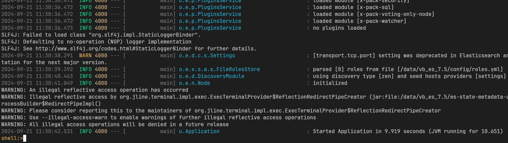

## 命令
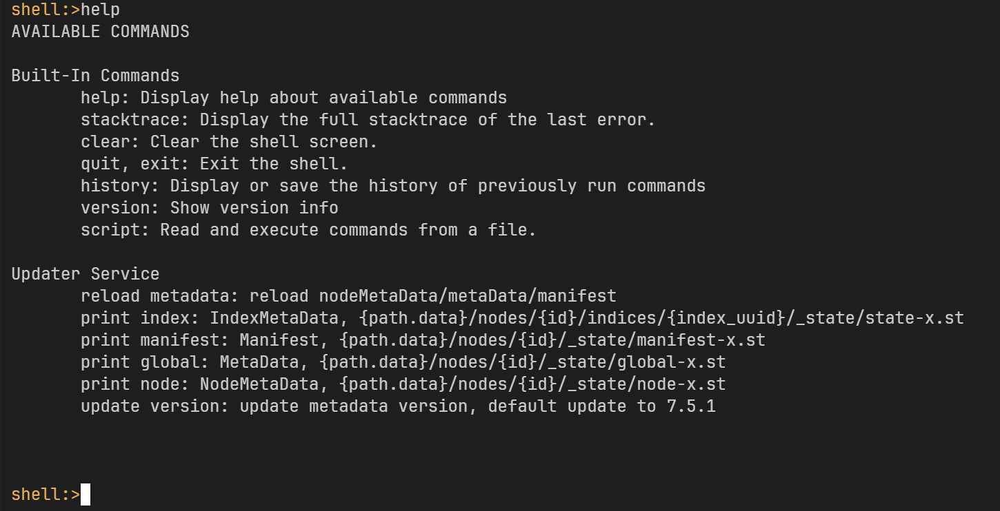

### print node
打印 NodeMetaData 内容，持久化文件路径为：{path.data}/nodes/{id}/_state/node-x.st
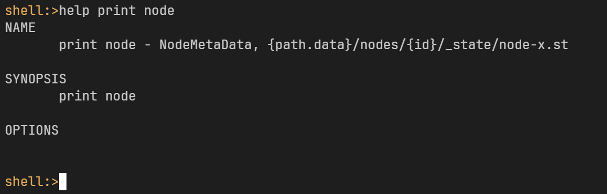
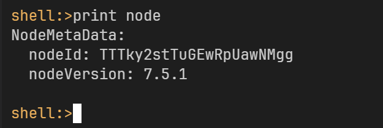

### print manifest
打印 Manifest 内容，持久化文件路径为：{path.data}/nodes/{id}/_state/manifest-x.st
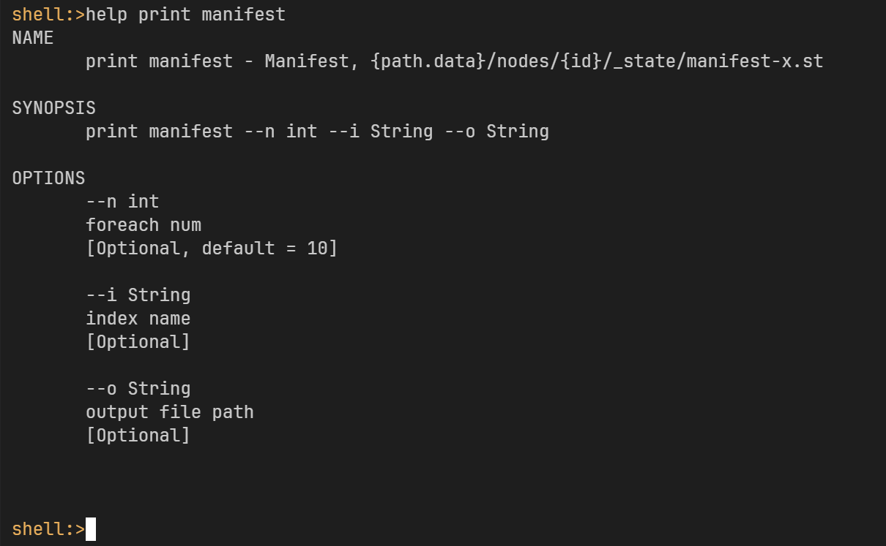
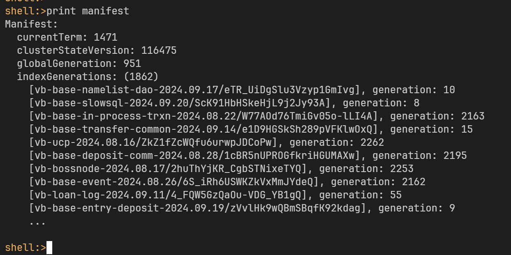

### print global
打印 MetaData 内容，持久化文件路径为：{path.data}/nodes/{id}/_state/global-x.st
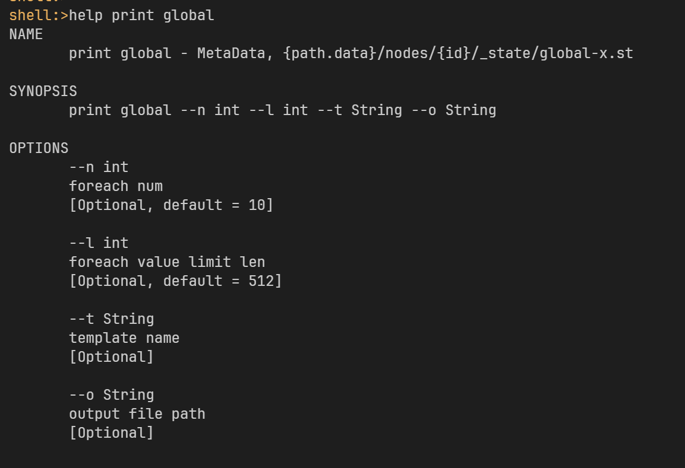
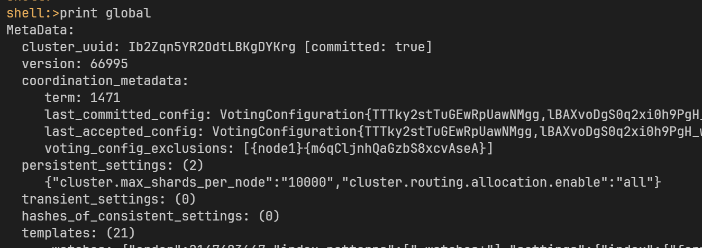

### print index
打印某个 IndexMetaData 内容，持久化文件路径为：{path.data}/nodes/{id}/indices/{index_uuid}/_state/state-x.st
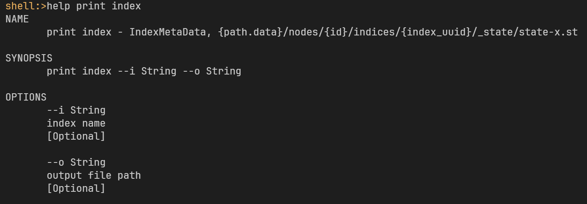
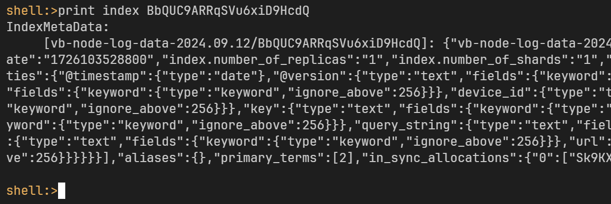

### update version
更新版本，更新 NodeMetaData/IndexMetaData 里边的版本号（降版本等），默认更新为 7.5.1（即7050199）
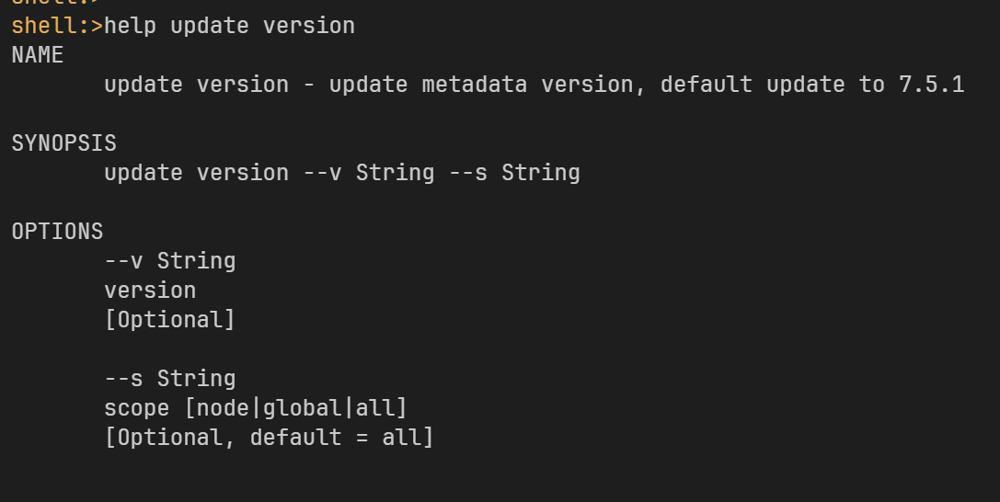

### reload metadata
重新从文件系统加载 NodeMetaData/Manifest/MetaData/IndexMetaData 等元数据内容
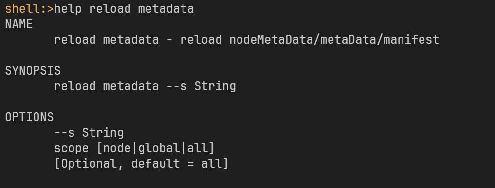
